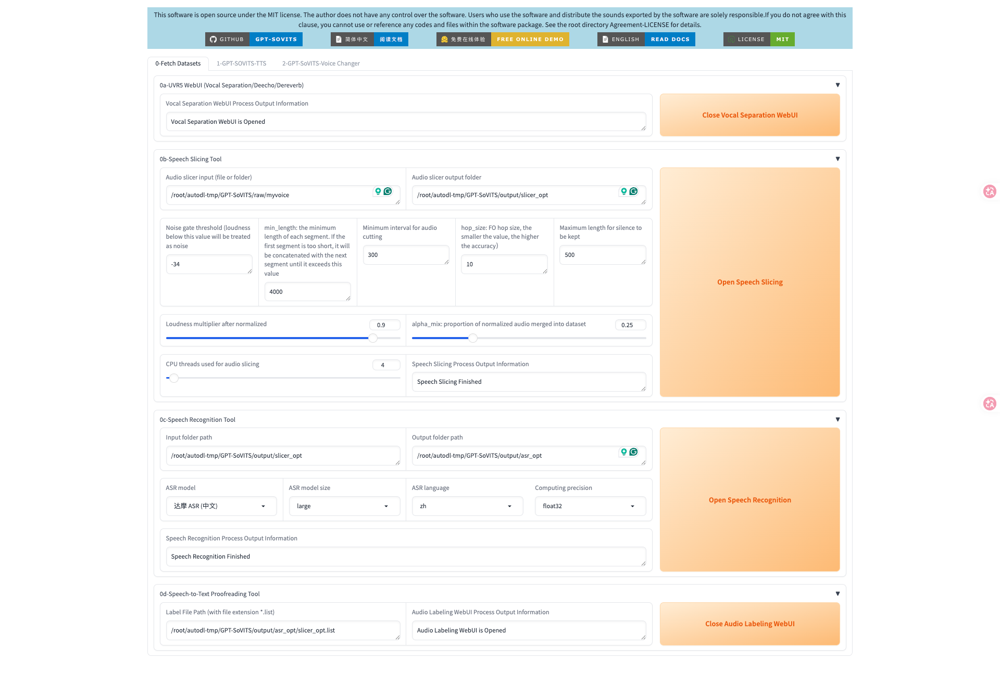
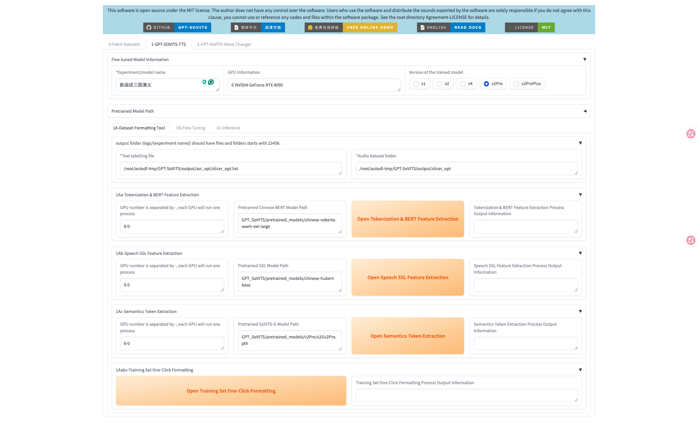
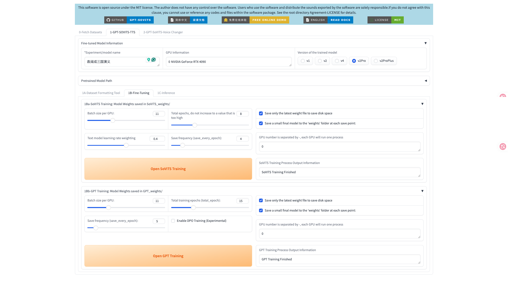
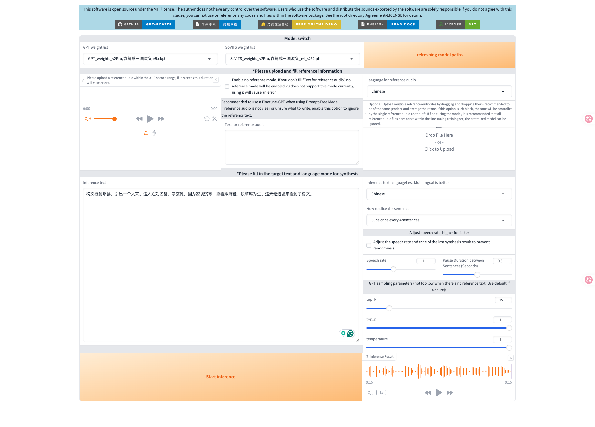
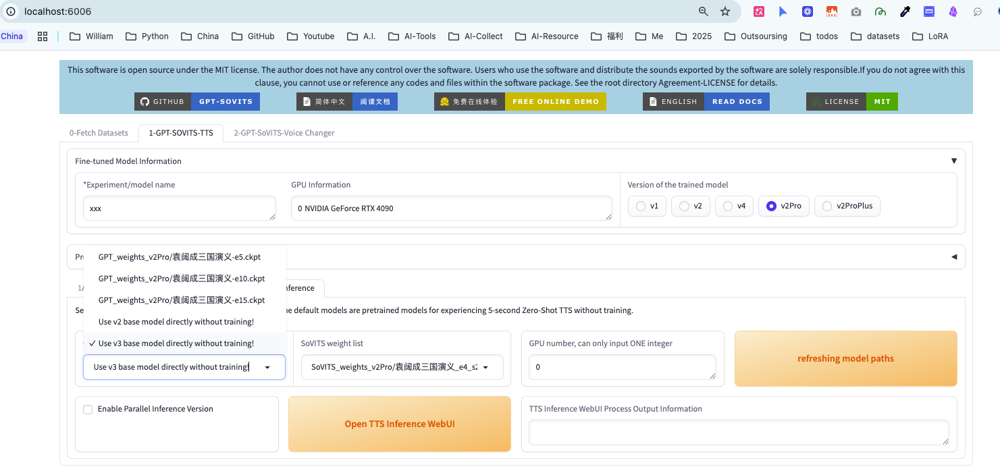
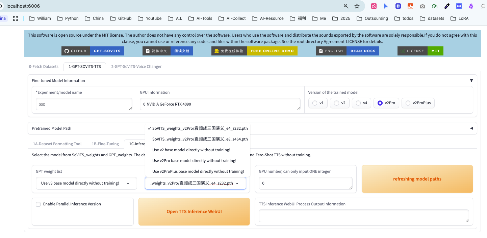

## GPT-SoVITS

## Screenshots

Below are screenshots of the WebUI and model selection panels used in this project. Image files are in the `assets/` folder.








## 1. local macbook m3 pro (NOT WORK)

1. git clone https://github.com/RVC-Boss/GPT-SoVITS
2. conda create -n GPTSoVits python=3.10
3. pip install -r requirements.txt...
4. python webui.py <-- ERROR

## 2. AutoDL (RTX 4090 * 1卡)

在AutoDL上训练成功（https://github.com/RVC-Boss/GPT-SoVITS）

### (1) Env
```text
镜像: PyTorch  2.5.1,  Python  3.12(ubuntu22.04) CUDA  12.4
GPU: RTX 4090(24GB) * 1
CPU: 20 vCPU Intel(R) Xeon(R) Platinum 8470Q
内存: 90GB
硬盘: 系统盘:30 GB
```

### (2) Install

```bash
source /root/miniconda3/etc/profile.d/conda.sh
conda create -n GPTSoVits python=3.10 -y
conda activate GPTSoVits
conda install pytorch==2.5.1 torchaudio==2.5.1 pytorch-cuda=12.4 -c pytorch -c nvidia -y

cd ~/autodl-tmp/GPT-SoVITS
pip install -r requirements.txt -i https://pypi.tuna.tsinghua.edu.cn/simple
python webui.py --host 0.0.0.0 --port 6006
python GPT_SoVITS/inference_webui.py
```

```bash
# Enable AutoDL's built-in academic speed boost
source /etc/network_turbo

# Then install from official (will be fast now)
pip install torch torchaudio --index-url https://download.pytorch.org/whl/cu124
```

### (3) Post-Install

- `Audio Prep → WebUI Launch → Slice/Denoise → ASR → Training → Inference`
- SoVITS = trains the voice timbre (how it sounds)
- GPT = trains the prosody/rhythm (how it speaks)

### (4) open UI

```bash
ssh -CNg -L 6006:127.0.0.1:6006 root@connect.cqa1.seetacloud.com -p 46840 #训练页
ssh -CNg -L 9871:127.0.0.1:9871 root@connect.cqa1.seetacloud.com -p 46840 #音字分离检测页面
ssh -CNg -L 9872:127.0.0.1:9872 root@connect.cqa1.seetacloud.com -p 46840 #inference页面
```

### (5) scp

```bash
$ cd `Samsung/.../袁阔成_三国演义`
$ scp -P 46840 三国演义1.mp3 root@connect.cqa1.seetacloud.com:/root/autodl-tmp/GPT-SoVITS/raw/

$ scp -P 46840 root@connect.cqa1.seetacloud.com:/root/autodl-tmp/GPT-SoVITS/GPT_weights_v2Pro/袁阔成三国演义-e15.ckpt ./autoDL
$ scp -P 46840 root@connect.cqa1.seetacloud.com:/root/autodl-tmp/GPT-SoVITS/SoVITS_weights_v2Pro/袁阔成三国演义_e8_s464.pth ./autoDL
$ scp -P 46840 root@connect.cqa1.seetacloud.com:/root/autodl-tmp/GPT-SoVITS/output.zip ./output```
```

### (4) 训练完成后的使用方式

- ✅ 选择训练好的 GPT 模型 (在 **GPT_weights**/ 下)
- ✅ 选择训练好的 SoVITS 模型 (在 **SoVITS_weights**/ 下)

## Scripts & downloads

This repository includes convenience scripts to pack training artifacts on the AutoDL/container side and to download them to your local machine.

- `scripts/pack_and_download.sh` — run inside the AutoDL container to collect SoVITS/GPT weights, logs, a few reference wavs and raw audio, package them into a tarball and generate a SHA256 file.
- `scripts/download_from_autodl.sh` — local helper to scp the tarball from the AutoDL host, verify SHA256 if present, and extract the archive.

Typical flow:

1. SSH into the AutoDL container and run:

```bash
chmod +x scripts/pack_and_download.sh
./scripts/pack_and_download.sh -o /root/autodl-tmp/yuan_artifacts.tar.gz
```

2. From your local machine run the provided downloader (replace host/port/identity):

```bash
chmod +x scripts/download_from_autodl.sh
./scripts/download_from_autodl.sh <autodl-host> <port> /root/autodl-tmp/yuan_artifacts.tar.gz ~/downloads -i ~/.ssh/id_rsa
```

See `scripts/README_DOWNLOAD.md` for more details.

## Options

- Docker M3: very slow
- Colab Pro: session persistence issues
- RunPod: China network slow