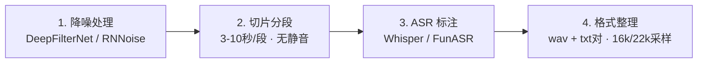

## Q

我想训练袁阔成评书AI音色，用于我的短视频的专属解说配音。
假设我已经有wav声音文件，如何训练，帮我生成解决方案


## A

1. .wav原始音频 (去噪/切片/标注) -> GPT-SoVITS 模型 -> SFT 微调 -> 推理API

2. 数据准备清单



### 推荐方案：GPT-SoVITS（首选）

核心理由：中文语音克隆效果目前最佳，社区活跃，支持评书这类高情感表达的音色，few-shot + fine-tuning 双模式。

### Step 1 — 选集筛选（不需要全部365集）

建议选 20–30 集，对应 ~2–3 小时音频

### Step 2 — MP3 批量转 WAV - ffmpeg

批量转换：16kHz 单声道（GPT-SoVITS 训练标准格式)

### Step 3 — 自动切片（VAD）

GPT-SoVITS 内置了切片工具, 切出 500–1000 个片段（≈ 30–60 分钟有效音频）, 最短3秒, 最长10秒

- 打开 http://localhost:9874
- → "UVR5人声分离" 先跑降噪（如有背景音乐）
- → "音频切片工具" 设置参数后批量切片

### Step 4 — ASR 自动标注

```text
选择模型：faster-whisper large-v3
  语言：zh
  输入目录：sliced/
  sliced/001.wav|袁阔成|zh|话说这三国鼎立，魏蜀吴各据一方
  sliced/002.wav|袁阔成|zh|且说曹操引兵南下，势如破竹
```

### Step 5 — 训练

- **AutoDL**（国内）或 RunPod（海外）
- 选择：RTX 4090 实例

### Step 6 — 快速出音效果验证（无需训练）


## 推荐执行顺序

```text
  brew install ffmpeg → 转WAV → 选20集
  GPT-SoVITS WebUI → 切片 + ASR标注（M3本机跑，2–4小时）
  零样本推理验证音色

满意后：
  AutoDL 租 4090 × 1–2小时 → 上传数据 → 跑完整SFT训练
  下载模型权重回本机 → 本机推理（M3推理够用）
```