# 详细说明评书音频数据准备和清洗的步骤

claude



下面是每个阶段的完整操作细节。

---

## ① 选集筛选

365集不需要全用。目标是 **30–60分钟高质量纯人声**，过多反而引入噪音干扰训练。

选集策略：
- 优先选**第1–80集**，早期录音背景音效较少，讲述节奏稳定
- 避免有打斗音效、配乐铺底的段落（用 Audacity 预览波形）
- 每集挑 5–10 分钟最纯净的段落即可，不必整集处理

```bash
# 建工作目录
mkdir -p ~/yuan_tts/{raw_mp3,wavs_raw,wavs_denoised,sliced,labeled}

# 先把选好的集数复制过来，例如第1–30集
cp 三国演义_00{1..9}.mp3 三国演义_0{10..30}.mp3 ~/yuan_tts/raw_mp3/
```

---

## ② MP3 → WAV 批量转换

```bash
cd ~/yuan_tts

for f in raw_mp3/*.mp3; do
    name=$(basename "$f" .mp3)
    ffmpeg -i "$f" \
        -ar 16000 \
        -ac 1 \
        -sample_fmt s16 \
        "wavs_raw/${name}.wav" \
        -y -loglevel error
    echo "转换完成: $name"
done

# 验证
echo "共转换: $(ls wavs_raw/*.wav | wc -l) 个文件"
du -sh wavs_raw/
```

---

## ③ 人声分离 / 降噪

评书音频常见两类噪音，处理方式不同：

| 情况 | 工具 | 说明 |
|---|---|---|
| 有背景音乐/混响 | UVR5（GPT-SoVITS内置） | 人声分离，去掉伴奏轨 |
| 环境底噪/嗡嗡声 | DeepFilterNet | 降低环境噪声 |
| 两者都有 | 先UVR5，再DeepFilterNet | 顺序不能反 |

```bash
# DeepFilterNet 降噪
pip install deepfilternet

cd ~/yuan_tts
mkdir -p wavs_denoised

python -m df.enhance \
    --model-base-dir "" \
    wavs_raw/ \
    -o wavs_denoised/

# 对比一个文件，确认降噪效果
# 用 ffplay 或 QuickTime 试听
ffplay wavs_raw/三国演义_001.wav
ffplay wavs_denoised/三国演义_001.wav
```

UVR5 在 GPT-SoVITS WebUI 里直接有界面，等 WebUI 修好后用图形界面操作更方便。

---

## ④ VAD 切片

这是最关键的步骤，**直接决定训练数据质量**。

```bash
# 用 GPT-SoVITS 内置切片工具
cd ~/my-tests/voices/GPT-SoVITS

python tools/slice_audio.py \
    --input ~/yuan_tts/wavs_denoised \
    --output ~/yuan_tts/sliced \
    --min_length 3000 \
    --max_length 10000 \
    --threshold -40 \
    --hop_size 10 \
    --max_silence_kept 500

echo "切片数量: $(ls ~/yuan_tts/sliced/*.wav | wc -l)"
```

参数说明：

| 参数 | 值 | 原因 |
|---|---|---|
| `min_length` | 3000ms | 太短的片段训练效果差 |
| `max_length` | 10000ms | 超过10秒切开，避免显存溢出 |
| `threshold` | -40dBFS | 评书停顿明显，-40适合断句 |
| `max_silence_kept` | 500ms | 保留自然停顿感，不要切太干 |

评书切片的特殊注意：
- 检查是否有句中断开（"话说——这三国"被切成两段）
- 保留完整的"哦""啊""且听下回分解"片段，这些是评书音色的关键特征
- 目标：500–1000个片段，总时长30–60分钟

```bash
# 快速统计总时长
python3 -c "
import wave, os, glob
total = 0
for f in glob.glob('$HOME/yuan_tts/sliced/*.wav'):
    with wave.open(f) as w:
        total += w.getnframes() / w.getframerate()
print(f'总时长: {total/60:.1f} 分钟 / {len(glob.glob(\"$HOME/yuan_tts/sliced/*.wav\"))} 个片段')
"
```

---

## ⑤ ASR 自动标注

```bash
pip install funasr modelscope

python3 << 'EOF'
from funasr import AutoModel
import os, glob, json

model = AutoModel(
    model="paraformer-zh",
    vad_model="fsmn-vad",
    punc_model="ct-punc",
    device="cpu"   # M3 Mac用cpu
)

sliced_dir = os.path.expanduser("~/yuan_tts/sliced")
wav_files = sorted(glob.glob(f"{sliced_dir}/*.wav"))

results = []
for i, wav_path in enumerate(wav_files):
    res = model.generate(input=wav_path, batch_size_s=300)
    text = res[0]["text"] if res else ""
    results.append((wav_path, text))
    if i % 50 == 0:
        print(f"进度: {i}/{len(wav_files)} — {text[:30]}...")

# 写出 esd.list
with open(os.path.expanduser("~/yuan_tts/esd.list"), "w", encoding="utf-8") as f:
    for wav_path, text in results:
        rel_path = os.path.relpath(wav_path, os.path.expanduser("~/yuan_tts"))
        f.write(f"{rel_path}|袁阔成|zh|{text}\n")

print(f"\n完成！共标注 {len(results)} 条")
EOF
```

---

## ⑥ 人工校对（最不能省的步骤）

ASR 准确率约85–90%，剩下10–15%的错误会直接污染训练。重点校对：

| 常见错误 | 错误示例 | 正确 |
|---|---|---|
| 儿化音 | "这二" | "这儿" |
| 叹词识别错 | "唉哟" → "哎哟" | 统一写法 |
| 人名地名 | "曹操" → "曹草" | 必须人工核对 |
| 断句标点 | 句中加了句号 | 按停顿修正 |
| 空白段落 | text="" | 删除这行 |

```bash
# 用脚本快速过滤明显问题
python3 << 'EOF'
issues = []
with open(os.path.expanduser("~/yuan_tts/esd.list"), encoding="utf-8") as f:
    for i, line in enumerate(f, 1):
        parts = line.strip().split("|")
        if len(parts) != 4:
            issues.append(f"行{i}: 格式错误")
            continue
        text = parts[3]
        if len(text) < 5:
            issues.append(f"行{i}: 文本过短 [{text}]")
        if len(text) > 150:
            issues.append(f"行{i}: 文本过长，可能标注错误")

print(f"发现 {len(issues)} 个问题:")
for issue in issues[:20]:
    print(" ", issue)
EOF
```

校对完成后检查最终数量：

```bash
wc -l ~/yuan_tts/esd.list
# 目标：500行以上，1000行最佳
```

---

## 最终目录结构

```
~/yuan_tts/
├── sliced/
│   ├── 三国演义_001_0001.wav
│   ├── 三国演义_001_0002.wav
│   └── ...（500–1000个文件）
└── esd.list   ← 送入GPT-SoVITS的训练清单
```

`esd.list` 格式：
```
sliced/三国演义_001_0001.wav|袁阔成|zh|话说这天下大势，分久必合，合久必分
sliced/三国演义_001_0002.wav|袁阔成|zh|且说曹操引兵南下，势如破竹，所向披靡
```

数据准备好后，整个目录打包上传到 AutoDL 跑训练，本机只做推理。